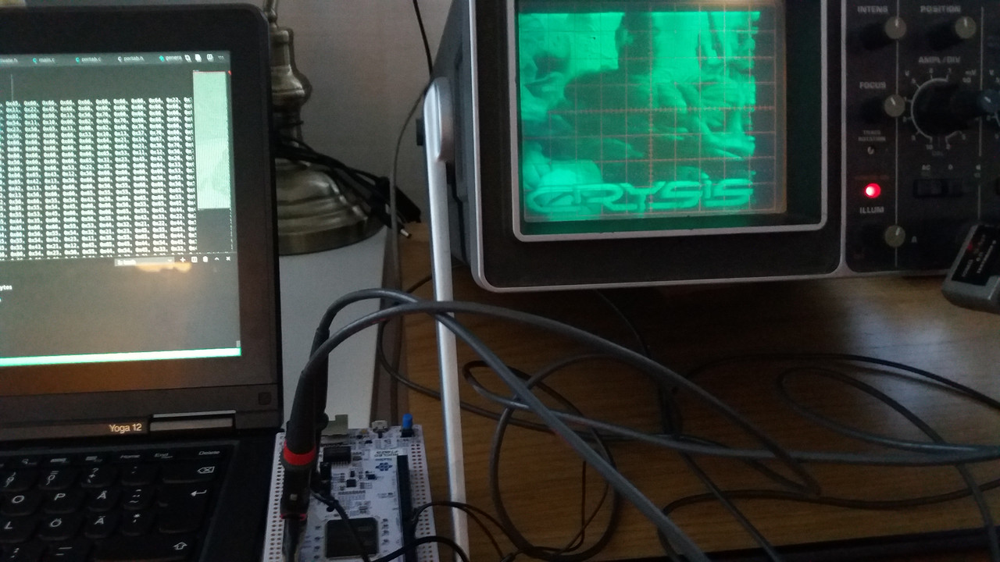

# CRT

Let's see if we can plot grayscale images on an old CRT oscilloscope.

## Um, yes?

 

## Notes

* DAC uses a dual-buffer scheme with direct memory access to achieve approx 1.3 MHz
* Greyscale is achieved by varying the x-channel speed. 3/4 bits supported.
* tools folder contain Python scripts to generate C arrays from jpeg/png images and to generate vscode intellisense bullshit
